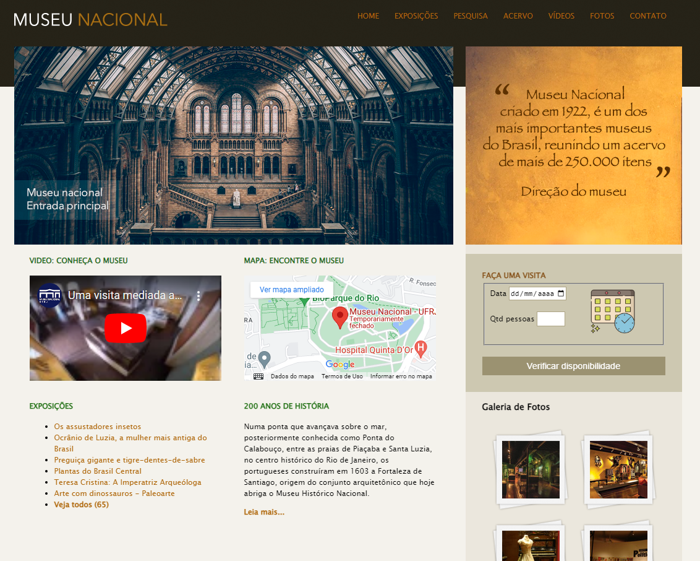

<h1 align="center"> Projeto Museu Nacional </h1>

Site desenvolvido com base no curso de desenvolvimento web completo pela Udemy.  

  

 

  

## 🚀 Tecnologias

Esse projeto foi desenvolvido com as seguintes tecnologias:

- HTML e CSS
- Github

## 💻 Projeto

É basicamente a simulação de um site real do Museu Nacional de UFRJ.

Possuindo a navegação por meio dos menus tanto na parte superior, quanto no rodapé do site.

Uma breve apresentação de conteúdos pertinentes ao museu, com imagens e descrições curtas.

- [Acesse o projeto finalizado, online](https://paullods.github.io/PJ-MuseuNacional/)

## :memo: Licença

Esse projeto está sob a licença MIT.

---

Feito com ♥
 
